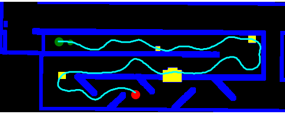
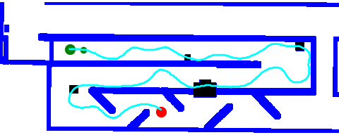

# ECE 046214 Mobile Robots Project

## Acronyms 
PP - Pure Pursuit  
MPC - Model Predictive Control  
RRT - Rapidly-exploring Random Tree  
KRRT - dynamic version of RRT. stands for Kino RRT

## Problem description
We have a planned trajectory we've found (using KinoRRT) and we want to follow it w/ a controller that minimizes the error from it.  
This can be done using the Pure Pursuit controller. However, if some unplanned obstacle is placed along the path, we will hit it if our robot doesn't sense it and correct it's path locally.  
We try to solve the obstacle/crowd avoidance problem by incorporating MPC (Model Predicitive Control) to it.  

In the examples below we can see the difference in real time obstacle avoidance.  

## Pure Pursuit only example

## Model Predicitive Control + Pure Pursuit (MPC + PP) example

#### Legend:  
white - free space  
blue - obstacles (originally when global planning was done)  
black - added real time obstacles over the planned trajectory  
cyan line - planned trajectory (by some planning algorithm like PRM or RRT. We used Kino RRT)  
green line - the actual trajectory (when we use PP only or MPC+PP)  
purple arc - the lidar like sensor model when it doesn't hit an obstacle  
red arc - the lidar like sensor model when it does hit an obstacle  
orange rectangle - local planner's search area, when we look for a local alternative to bypass the obstacle in our way using local start and goal and running  
red line - the selected local KinoRRT path found when we search locally  
light green ball - the PP look ahead point on the originally planned trajectory  
big green ball - start point  
big red ball - goal point  

We can see that the PP controller doesn't avoid any new obstacle (in black) along the planned trajectory and just crashes into it; in contrast to MPC, which is running a local search for a new path to bypass the new obstacle in front of the robot.

We simulate the Lidar beam by an arc that gives a future obstacle ahead of the robot. When there is no collision in the near future, a regular PP control is applied. Otherwise, we start the MPC flow and we run it for several iterations even though we don't identify an obstacle ahead (hyper parameter).  

## MPC + PP flow

1. Define the local goal - it looks ahead as in PP but w/ different L constant, and sets the local goal as a point along the planned trajectory, after the obstacle. If the obstacle is big and the goal is in collision, we continue and increase the goal index along the planned trajectory until we're out of collision. We also add some extra indices (another hyper parameter to tune) after we are not in collision in order to have a feasilbe local goal.  
2. Define the local start - the local start is our current location.  
3. Calculate the local search rectangle - we define another parameter called margin in order to have some margins around the start and goal. We then calculate the bounding box of these 2 sqaures.  
4. Run KinoRRT to find a local new path - run KRRT locally for several times (predefined hyper parameter to tune) and select the best one of them. The best currently stands for the shortest, but a more sophisticated cost functions can be applied. We also let each KRRT run for a predefined max amount of iterations (another hyper parameter) and if it doesn't find a path at all (from all tries) we don't use the search and continue as in PP controller.
5. Select the first state along the path - we take the first state along the path, calculate the steering needed for it (as if it was the look ahead point) and apply that steering.
6. We keep repeating the above until we're out of MPC mode.

